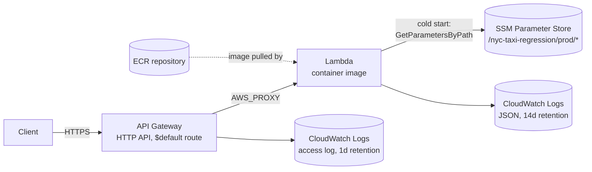

# nyc_taxi_regression

A regression model that predicts **NYC taxi trip duration**, served as a REST
API and deployed as a **container-image AWS Lambda** behind API Gateway.
Infrastructure is fully defined in Terraform and shipped through a GitHub
Actions CI/CD pipeline that authenticates to AWS via OIDC (no long-lived
AWS keys).

## Contents

- [What it does](#what-it-does)
- [Architecture](#architecture)
- [API](#api)
- [Project layout](#project-layout)
- [Requirements](#requirements)
- [Run locally](#run-locally)
- [Run the Lambda image locally](#run-the-lambda-image-locally)
- [Configuration](#configuration)
- [Model training](#model-training)
- [Infrastructure (Terraform)](#infrastructure-terraform)
- [CI/CD](#cicd)
- [First-time infra bootstrap](#first-time-infra-bootstrap)
- [Tech stack](#tech-stack)

## What it does

`src/nyc_taxi_regression/train_model.py` trains a scikit-learn
`HistGradientBoostingRegressor` on the Kaggle
[`yasserh/nyc-taxi-trip-duration`](https://www.kaggle.com/datasets/yasserh/nyc-taxi-trip-duration)
dataset and pickles it to `nyc_city_taxi.pkl` (target: `log1p(trip_duration)`).

A FastAPI app (`src/nyc_taxi_regression/main.py`) loads that pickle once at
startup and exposes a single endpoint, `POST /predict`, that turns a trip's
pickup location, time, vendor and passenger count into a predicted duration
in seconds.

The same FastAPI app is wrapped with [Mangum](https://mangum.io/) so it can
run unmodified both as a normal ASGI server (local dev) and as an AWS Lambda
handler behind API Gateway (production) — there is no separate "Lambda
version" of the code.

## Architecture



Request flow: API Gateway (HTTP API, `$default` stage, `auto_deploy`)
forwards every request as an `AWS_PROXY` integration to a single Lambda
function running the container image published to ECR. Mangum translates
the API Gateway v2 event into an ASGI call into the same FastAPI app used
locally. The model file (`nyc_city_taxi.pkl`) is baked into the image, so
prediction never touches the network — the only outbound call the Lambda
makes is reading non-secret/secret config from SSM Parameter Store once per
cold start (cached in-process afterwards via `lru_cache`).

## API

### `POST /predict`

Request body:

```json
{
  "passenger_count": 2,
  "pickup_longitude": -73.98,
  "pickup_latitude": 40.75,
  "vendor_id": 2,
  "pickup_datetime": "2016-06-01T12:00:00Z"
}
```

| field              | type            | constraints                          |
| ------------------ | --------------- | ------------------------------------- |
| `passenger_count`  | int             | `1 <= x <= 6`                          |
| `pickup_longitude` | float           | `-74.03 <= x <= -73.75` (NYC bounds)   |
| `pickup_latitude`  | float           | `40.63 <= x <= 40.85` (NYC bounds)     |
| `vendor_id`        | int enum        | `1` or `2`                             |
| `pickup_datetime`  | ISO-8601 datetime | timezone-aware values are converted to `America/New_York` |

Response body:

```json
{ "trip_duration": 612.4 }
```

`trip_duration` is in seconds (the model predicts `log1p(duration)`; the API
applies `expm1` before returning).

```bash
curl -X POST "$API_URL/predict" \
  -H 'content-type: application/json' \
  -d '{"passenger_count":2,"pickup_longitude":-73.98,"pickup_latitude":40.75,"vendor_id":2,"pickup_datetime":"2016-06-01T12:00:00Z"}'
```

Interactive docs (local/dev server only): `GET /docs` (Swagger) and
`GET /redoc`.

## Project layout

```
src/nyc_taxi_regression/
  main.py            # FastAPI app: CORS + router wiring, loads the model on lifespan startup
  lambda_handler.py   # Mangum(app) — the Lambda entrypoint (CMD in the Dockerfile)
  settings.py         # pydantic-settings config, SSM Parameter Store integration
  routers/predict.py  # POST /predict route
  schemas/predict.py  # request/response Pydantic models
  services/predict.py # loads the pickle, builds the feature frame, runs the prediction
  train_model.py       # reproducible training script -> nyc_city_taxi.pkl
  train_model.ipynb    # exploratory notebook version of the same pipeline
nyc_city_taxi.pkl      # trained model, baked into the Docker image
Dockerfile             # multi-stage build on the AWS Lambda Python 3.12 base image
infra/                 # Terraform: ECR, Lambda, API Gateway, IAM, GitHub OIDC
.github/workflows/     # ci.yml (plan on PR) and cd.yml (build+push+apply on main)
docs/ssm-com-terraform.md  # deep dive on the config/secrets-via-SSM pattern used in infra/
```

## Requirements

- Python 3.12 (see `.python-version`)
- [uv](https://docs.astral.sh/uv/) for dependency management
- Docker, to build/run the deployable image
- Terraform >= 1.10 and the AWS CLI, only if you touch `infra/`
- A Kaggle account/API token, only if you re-run `train_model.py`

## Run locally

```bash
uv sync                        # installs deps + the package itself (src layout)
cp .env.example .env           # CLIENT_URL for CORS; DATASET_PATH is training-only

uv run fastapi dev src/nyc_taxi_regression/main.py
# or: uv run uvicorn nyc_taxi_regression.main:app --reload
```

This runs the real FastAPI app (not the Lambda handler) on
`http://localhost:8000`, with `MODEL_PATH` unset — `services/predict.py`
falls back to `nyc_city_taxi.pkl` at the repo root, which is committed for
this reason. No AWS credentials are needed for this path: `SSM_PREFIX` is
unset locally, so `settings.py` skips SSM entirely and reads `.env`.

## Run the Lambda image locally

The Dockerfile builds on `public.ecr.aws/lambda/python:3.12` — the image's
`CMD` is the Lambda Runtime Interface Client, not a plain HTTP server. To
exercise the exact artifact that ships to production:

```bash
docker build -t nyc-taxi-regression .
docker run -p 9000:8080 nyc-taxi-regression
```

Invoke it through the Lambda Runtime Interface Emulator endpoint with an API
Gateway v2 proxy event (Mangum expects a Lambda event, not a raw HTTP
request):

```bash
curl -XPOST "http://localhost:9000/2015-03-31/functions/function/invocations" \
  -d '{
        "version": "2.0",
        "routeKey": "$default",
        "rawPath": "/predict",
        "requestContext": {"http": {"method": "POST", "path": "/predict"}},
        "headers": {"content-type": "application/json"},
        "body": "{\"passenger_count\":2,\"pickup_longitude\":-73.98,\"pickup_latitude\":40.75,\"vendor_id\":2,\"pickup_datetime\":\"2016-06-01T12:00:00Z\"}",
        "isBase64Encoded": false
      }'
```

The build is a two-stage `uv export --frozen` install (reproducible,
lockfile-pinned deps) followed by `python -m compileall` to pre-compile
`.pyc` files — this was measured to cut init time ~2.2s→0.7s and first
invocation ~5.3s→1.9s by avoiding recompiling pandas/sklearn on every cold
start.

## Configuration

`settings.py` resolves config with this precedence (highest first):

1. **SSM Parameter Store**, only when `SSM_PREFIX` is set (i.e. running in
   Lambda) — read once via `get_parameters_by_path` and cached.
2. **Environment variables**
3. **`.env` file** at the repo root (local dev)
4. **Defaults** in `Settings`

| variable       | meaning                                                          |
| -------------- | ----------------------------------------------------------------- |
| `CLIENT_URL`   | single allowed CORS origin for the API                            |
| `MODEL_PATH`   | path to the pickled model (set by the Dockerfile in Lambda; falls back to the repo-root `.pkl` locally) |
| `SSM_PREFIX`   | set by Terraform on the Lambda; enables the SSM read path         |
| `DATASET_PATH` | Kaggle dataset id used by `train_model.py` only — irrelevant to the API |

## Model training

```bash
uv run python src/nyc_taxi_regression/train_model.py
```

Requires Kaggle API credentials available to `kagglehub` (`~/.kaggle/kaggle.json`
or `KAGGLE_USERNAME`/`KAGGLE_KEY`). The script:

1. downloads the dataset via `kagglehub`;
2. drops trips outside sane bounds (duration 60s–3h, 1–6 passengers, pickup
   inside the NYC lon/lat box used by the API's own request validation);
3. one-hot encodes `vendor_id` (drop-if-binary → single `vendor_id_2` column)
   and derives `pickup_hour` / `pickup_dayofweek` from `pickup_datetime`;
4. fits a `HistGradientBoostingRegressor` on `log1p(trip_duration)`;
5. writes `nyc_city_taxi.pkl` to the repo root — the exact file the API and
   Docker image consume.

`train_model.ipynb` is the exploratory notebook counterpart of the same
pipeline.

## Infrastructure (Terraform)

Everything lives in `infra/`, one AWS account/region (`us-east-1` by
default), state name-prefixed with `${project_name}-${environment}`
(default `nyc-taxi-regression-prod`).

| file               | resources |
| ------------------ | --------- |
| `backend.tf`        | Remote state in S3 (`nyc-taxi-regression-tfstate-<account>`), encrypted, native S3 locking (`use_lockfile`, Terraform ≥1.10 — no DynamoDB lock table needed). The bucket itself is created out-of-band via the CLI before the first `init`. |
| `versions.tf` / `providers.tf` | Terraform ≥1.10, `hashicorp/aws` ~>6.0, `default_tags` applied to every resource (`Project`, `Environment`, `ManagedBy=terraform`). |
| `ecr.tf`             | ECR repository, **immutable** tags, `scan_on_push`, lifecycle policy keeping only the 3 most recent images. |
| `lambda.tf`          | Lambda function, `package_type = Image` pulling `<ecr_repo>:<image_tag>`, x86_64, 1024 MB / 30s timeout, JSON structured logs (CloudWatch, 14d retention). Env vars: `SSM_PREFIX` and `CONFIG_VERSION` (a hash of `app_config` — changing config forces a new function version so a live container isn't left reading stale env). |
| `apigateway.tf`      | HTTP API (v2), single `$default` route, `AWS_PROXY` integration to the Lambda, `auto_deploy`, access logs to CloudWatch (1d retention), throttling (burst 20 / rate 10 req/s), and the `lambda:InvokeFunction` permission for `apigateway.amazonaws.com`. |
| `iam.tf`             | Lambda execution role: AWS-managed `AWSLambdaBasicExecutionRole` + an inline policy scoped to `ssm:GetParameter*` under `/project/env/*` and `kms:Decrypt` on the default `alias/aws/ssm` key (needed for `SecureString` parameters). |
| `github_oidc.tf`     | Account-level GitHub OIDC provider + a deploy role that GitHub Actions assumes via `AssumeRoleWithWebIdentity`. Trust is locked to this exact repository (`sub` claim matches `repo:<owner>/<repo>:ref:refs/heads/main` for deploys and `repo:<owner>/<repo>:pull_request` for PR plans) — see [permissions](#cicd) below. |
| `variables.tf`       | `project_name`, `environment`, `aws_region`, required `image_tag` (passed by CI on every plan/apply), `app_config` (non-secret map, Terraform-owned → becomes SSM `String` params), `app_secrets` (names only — values are set out-of-band via `aws ssm put-parameter` and Terraform never sees or stores them). |
| `outputs.tf`         | `ecr_repository`, `lambda_function_name`, `api_endpoint`, `github_actions_role_arn`. |

The config/secrets split (`app_config` vs `app_secrets`) and the SSM prefix
convention are documented in detail in
[`docs/ssm-com-terraform.md`](docs/ssm-com-terraform.md).

### GitHub Actions IAM permissions (`github_oidc.tf`)

The deploy role is scoped, not admin:

- Terraform state: `s3:GetObject/PutObject/DeleteObject` on the state
  object, `s3:ListBucket` on the bucket.
- ECR: `ecr:GetAuthorizationToken` (account-wide, the only ECR action that
  doesn't support resource scoping) plus `ecr:*` scoped to this project's
  repository only.
- Application stack: wildcard `lambda:*` / `apigateway:*` / `logs:*` /
  `ssm:*` / `kms:DescribeKey` — wildcarded because most of these APIs don't
  support resource-level permissions and Terraform must be able to read
  resources that don't exist yet on the very first apply.
- IAM: scoped to role names carrying the project's `name_prefix`, so CI can
  manage the Lambda's own role but can never create/escalate to an
  unrelated or admin role.
- `iam:GetOpenIDConnectProvider` on the OIDC provider itself (read on every
  plan).

## CI/CD

Two workflows, both authenticating via GitHub OIDC → AWS STS
(`aws-actions/configure-aws-credentials`, `role-to-assume: ${{ vars.AWS_ROLE_ARN }}`)
— no static AWS access keys stored as GitHub secrets.

### `ci.yml` — pull requests into `main`

Read-only, no AWS mutation:

- **docker**: `docker build` the same `Dockerfile` used for deploys, without
  pushing — catches a broken build before merge.
- **terraform**: assumes the deploy role, then `terraform fmt -check`,
  `init`, `validate`, `plan` (using a short-SHA `image_tag`, matching what
  `cd.yml` would push). Concurrency group is per-`ref` with
  `cancel-in-progress: true`, so a new push cancels a stale plan instead of
  racing it for the state lock.

### `cd.yml` — pushes to `main`

Single job, `concurrency: cd-prod`, `cancel-in-progress: false` on purpose —
killing a `terraform apply` mid-flight is the surest way to corrupt state:

1. compute `image_tag` = short commit SHA;
2. assume the deploy role, log in to ECR;
3. check whether that tag already exists in ECR — the repo is `IMMUTABLE`,
   so re-running a job that already pushed (e.g. "Re-run failed jobs") would
   otherwise fail on the second push; build+push is skipped if the tag is
   already there;
4. `terraform init` + `terraform apply -auto-approve -var image_tag=...`;
5. **smoke test**: read the `api_endpoint` output and `POST /predict` a
   known payload, retrying 3× with a 10s backoff; the job fails the deploy
   if none of the attempts return `200`.

## First-time infra bootstrap

One-time, run locally with your own AWS credentials before CI can take over:

1. Create the state bucket referenced in `backend.tf` (it must exist before
   `terraform init` can use it as a backend) and enable versioning/encryption.
2. `cd infra && terraform init && terraform apply` once, to create the
   ECR repo, the GitHub OIDC provider and the deploy role — the very things
   CI needs in order to run itself. `image_tag` can be any placeholder tag
   for this first apply.
3. Set the GitHub Actions repository variable `AWS_ROLE_ARN` to the
   `github_actions_role_arn` output.
4. Confirm `github_repository` in `variables.tf` matches your fork
   (`owner@<owner-id>/repo@<repo-id>` — GitHub's immutable numeric IDs are
   appended so the trust policy survives a repo rename/transfer).
5. For any name listed in `app_secrets`, set its value out-of-band:
   `aws ssm put-parameter --name /nyc-taxi-regression/prod/<name> --type SecureString --value ...`.

From here on, `ci.yml` plans every PR and `cd.yml` builds, pushes and
applies on every merge to `main`.

## Tech stack

- **API**: FastAPI, Pydantic v2 / pydantic-settings, Mangum (ASGI→Lambda adapter)
- **Model**: scikit-learn (`HistGradientBoostingRegressor`), pandas, numpy
- **Packaging**: uv (dependency resolution + build), Docker (AWS Lambda base image)
- **Infra**: Terraform (AWS provider), ECR, Lambda (container image),
  API Gateway (HTTP API v2), IAM, SSM Parameter Store, S3 (remote state)
- **CI/CD**: GitHub Actions, OIDC federation to AWS (no static credentials)
